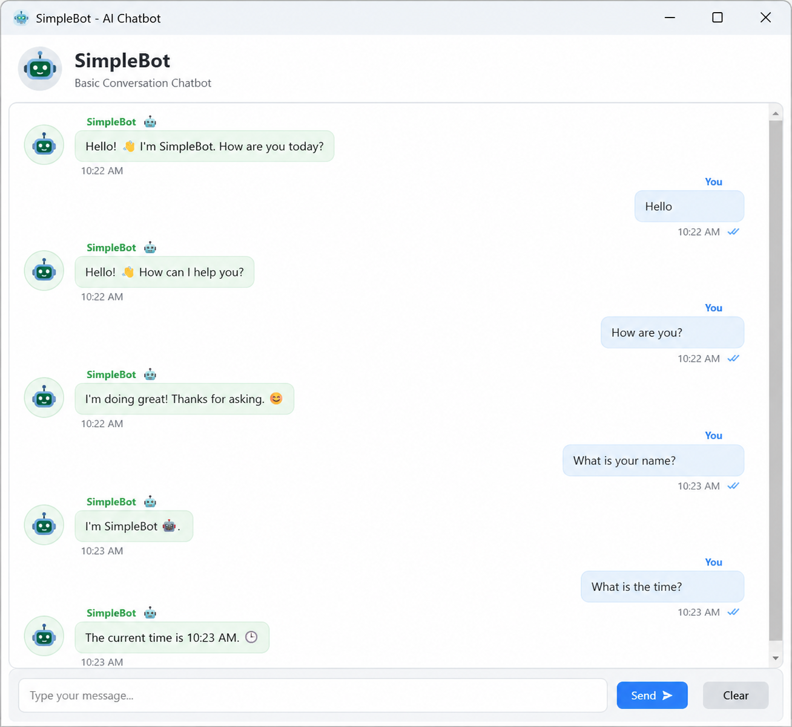

# 🤖 Simple GUI Chatbot

A simple and attractive **Python GUI chatbot** that can handle basic conversation.

## ✨ Features

- Modern light and clean interface
- Chat window
- User and bot messages
- Send button
- Press **Enter** to send messages
- Clear Chat button
- Basic conversation
- Greetings and common questions
- Current date and time responses
- No external Python packages required

## 🖥️ Screenshot



## 🛠️ Technologies

- Python
- Tkinter
- Random module
- DateTime module

## 📁 Project Structure

```text
Simple-GUI-Chatbot/
├── chatbot.py
├── README.md
├── requirements.txt
└── screenshot.png
```

## ▶️ How to Run

### 1. Install Python

Check that Python is installed:

```bash
python --version
```

If that does not work on Windows:

```bash
py --version
```

### 2. Open the project folder

Open this folder in VS Code.

### 3. Run the chatbot

```bash
python chatbot.py
```

or:

```bash
py chatbot.py
```

## 💬 Example Messages

Try:

- Hello
- How are you?
- What is your name?
- Who are you?
- What can you do?
- What is the time?
- What is today's date?
- I am happy
- Thank you
- Good morning
- Bye

## 🚀 Future Improvements

- Voice input
- Text-to-speech
- Dark mode
- Chat history
- AI API integration
- More intelligent responses
- Database support

## 📄 License

This project is available for educational and personal use.
